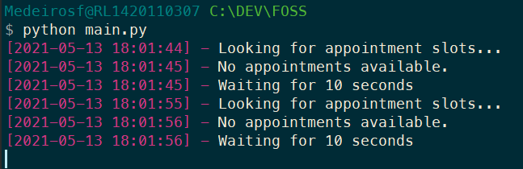

# Irish / Ireland Immigration Appointment Finder - INIS - GNIB - IRP

This is a very simple python script to help you find an appointment slot on Ireland Immigration Online Booking System - https://burghquayregistrationoffice.inis.gov.ie/

This script will query the website for new appointment slots every 10 seconds (you can change the time), and as soon as it finds an available slot, it will open your browser on the INIS "**Make Appointment**" form, for you to enter your details and submit.

Release yourself from the burden of endlessly looking for an appointment, and let the script do it for you. You just need to fill the form when it finds an available appointment. :grinning:

## Motivations
Ever since the Irish Online Appointment System was available, in 2016, quickly several pages on Facebook and websites arose around the internet **selling appointments**. They are mainly managed by bots and/or people with automation scripts, that block-book all the available slots as soon as they are available, just to sell it later and make a profit.

This makes finding an available appointment **nearly impossible** for people like you and me, that need it. The government even tried to tackle this issue with a new release around 2018 that added a captcha, but it didn't solve anything. You can easily find people that charge between **€20.00 and €40.00 per person** for an available slot.

To make things worse, the exact time that appointments are released is **completely random**. Even though the [INIS Office Website](https://burghquayregistrationoffice.inis.gov.ie/) states that it's released **daily** around 14:30, that's just not true. My coworker found his booking at **10:30** and I found mine at **15:40** - in both cases, the slot was freed seconds before. This means a real person must constantly check the website every minute or so for new appointments, since you never know when will the next slots be released. It's burdening for a real person, but *easy peasy* for a bot and people that exploit this scenario. :confused:

## Installation
This script requires **Python 3.7+**. If you don't have it yet, just head to [Python Download page](https://www.python.org/downloads/) and get the latest version. Don't forget to check the **Add Python to PATH** checkbox, as it will make it easier to use.

Next, we need to install the dependencies. About the dependencies, this script use only one: **requests**. I'm not creating a `requirements.txt` file for just one dependency, so just type `$ pip install requests` in your terminal, and you are done. If you don't know how to install pip packages, please refer to [this guide.](https://datatofish.com/install-package-python-using-pip/)

Having this sorted out, grab the code! Clone this repository, or download the code as a zip using the green **Code** button above, and you are ready to go.

## Usage
Once you have python and the dependencies installed, open a terminal on the directory where you downloaded the code, and type: `$ python main.py`. 

The worker will start looking for appointments and you can track its progress in the terminal, but you don't have to. Just leave it running, and go back to working on whatever you were doing. Once it finds some slots, you will be surprised by your browser opening spontaneously in the INIS Form - then, you know what to do. After opening the browser, the script will then stop.

This script was tested under Windows having Google Chrome as the default browser, and on Manjaro Linux having Firefox as the default browser.

Once the script find an appointment, it'll also print a colorful pattern, see below:

### Options
Under the [constants.py](constants.py) file, you will find a few options:
 - **SLEEP_SECONDS = 10**: The time the script will wait between queries on the INIS Website. I'd advise against setting it below 5 seconds, as having many users might turn the website down. 
 - **OPEN_BROWSER = True**: Sets if should open the browser when an appointment is found. You might want to disable it if you are running the script in WSL and don't have a X11 Server in windows to forward the WSL Browser to your computer. Disabling it, you will know when an appointment is found by looking at the beautiful rainbow pattern printed in your console :rainbow:
  - **STOP_ON_FIND = True**: Setting it to **False**, the script will not stop when an appointment is found.
  - **DEBUG = False**: Setting this to **True** will cause the response's JSON and error messages to be printed. Otherwise, those are omitted.

## Tips for getting an appointment quicker
After I finished this script, I found my appointment in less than 10 hours, for 15 days ahead. Quite impressive if you ask me, most people try for weeks with no success.
Here are some tips to help you get your appointment quicker:
### Be quick!
Remember you are competing with bots :robot:  Lots of them. There's no time to lose, you gotta be fast! When the browser open, don't waste time!
### Don't manually fill the form.
You'll probably take about a minute to fill the entire form - all the fields. A bot can fill the form in less than a second. You must level your game. There are some handy browser extensions (Such as [this one](https://chrome.google.com/webstore/detail/inis-irpgnib-lite-plus/jknfcjdggliplhgdhhcbkenlidkilnah)) that save your information and auto-fill the INIS form with a click. Use them!
### Don't pick the earliest appointment
You will be tempted to pick the first, early appointment available. Don't do this. Always remember the bots! The website is quite slow to process appointment requests, and by the time you send your data, a bot will have sent theirs and have the appointment reserved. You will be greeted with a "The appointment is no longer available" message. Always skip the first few entries, and get the next ones.
